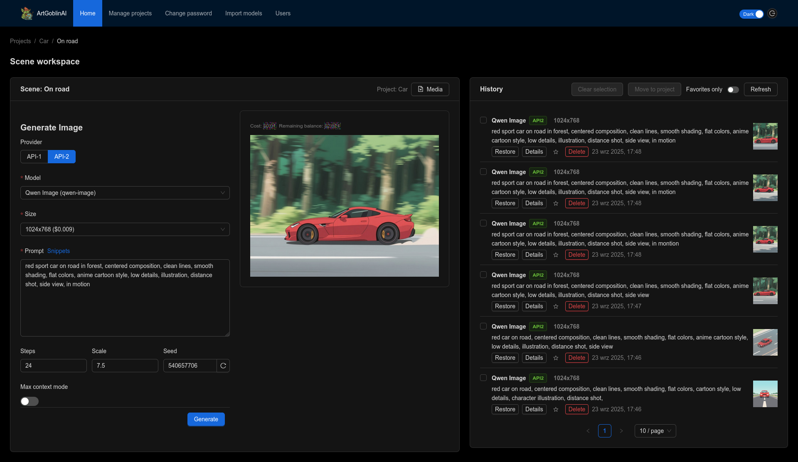

#  ArtGoblinAI — AI Image Generator using Nano-GPT.com

## ⚠️ WARNING

This project is **vibe-coded**: built quickly for internal use and experimentation.  
It is **not** production-grade and **should not be exposed** to the public internet.

---

## 🚀 Overview

[](assets/screenshot.png)

This project is a small web application for experimenting with AI-generated images.  
It provides a simple way to manage your creative workflow, including:

- **Projects** – group your work into separate spaces.  
- **Scenes** – organize prompts and results within a project.  
- **History of generated images** – every prompt and its outputs are stored locally for later browsing.  
- **Snippets** – save and reuse prompt fragments.  

Under the hood:

- Fastify-based API that proxies [Nano GPT](https://nano-gpt.com) image generation endpoints.  
- Images are stored locally, prompts and metadata are tracked in SQLite.  
- [Drizzle ORM](https://orm.drizzle.team/) handles database access.  
- Basic JWT-based authentication for local sessions.

---

## 🔄 Updating Model Metadata

To keep the list of models up to date with Nano GPT:

1. Open [https://nano-gpt.com/pricing](https://nano-gpt.com/pricing) in your browser.
2. Open DevTools (F12), go to the Console tab.
3. Paste and run the script from: `utils/model_scrapper.js`.
4. Script will generate models file, download it.
5. Use model import page in app as admin user.

This ensures your app reflects current models, names, and pricing from the Nano GPT API.

---

## ⚙️ Requirements

To run this project you need:

- **Node.js v22** (LTS or newer 22.x release)  
- **pnpm** as the package manager  

---

## 🛠️ Running locally - dev mode

1. Install dependencies:
   ```bash
   pnpm install
   ```

2. Copy and configure your environment file:
   ```bash
   cp .env.example .env
   ```

3. Initialize the database:
   ```bash
   pnpm --filter backend db:migrate
   ```

4. Launch both frontend and backend:
   ```bash
   pnpm dev
   ```

---

## ⚙️ Environment Variables

Values are loaded from `.env`. See `.env.example` for defaults.

| Key                | Description |
|--------------------|-------------|
| `BACKEND_PORT`     | Port used by Fastify (default: 3000, mapped to 8080 in Docker) |
| `PORT`             | Used by docker compose, should be the same as BACKEND_PORT |
| `API_KEY`          | Required Nano GPT API key for real image generation |
| `NANO_GPT_BASE_URL`| Base URL for upstream API (default: `https://nano-gpt.com`) |
| `JWT_SECRET`       | Used to sign auth cookies — **replace in production** |
| `COOKIE_SECURE`    | Enforce secure cookies (`true` / `false`) |
| `NODE_ENV`         | Standard Node.js environment (`development`, `production`, etc.) |
| `DB_FILE_NAME`     | SQLite file path or connection string |
| `GENERATED_DIR`    | Output path for generated image files |

---

## Initial setup (First-Run Wizard)

When the application starts for the very first time, it will detect that no users exist yet.  
In this case, a **setup wizard** will automatically appear in your browser.

The wizard will guide you through creating the initial administrator account:

- You will choose your own **username** and **password**.  
- This account will have full access to the application.  
- The wizard runs **only once** – after the admin user is created, it will never appear again.

⚠️ **Important:** Keep your administrator credentials safe. There are no default passwords stored in the application, so you are responsible for remembering them.

---

## Resetting the setup wizard

If you ever need to reset the application and run the setup wizard again, you can clear the database.  
This will also remove **all existing data** (users, history, settings). Generated image files are not deleted.

Run the following command from the project root:

```bash
pnpm --filter backend run db:seed
```

This will wipe the database and re-initialize it in an empty state.
At the next startup, the setup wizard will be shown again so you can create a new administrator account.

⚠️ Warning: This action is destructive and cannot be undone. Make sure you really want to remove all data before running it.

---

## 🗃️ Database Migrations

This project uses [Drizzle ORM](https://orm.drizzle.team/) migrations to manage database schema changes.
Migration files are stored in `apps/backend/drizzle/`.

### Available commands

| Command | Description |
|---------|-------------|
| `pnpm --filter backend db:generate` | Generate a new migration after changing schema |
| `pnpm --filter backend db:migrate` | Apply pending migrations |
| `pnpm --filter backend db:push` | Push schema directly (dev only, no history) |
| `pnpm --filter backend db:baseline` | Mark initial migration as applied (for legacy DBs) |

### Workflow for schema changes

1. Modify the schema in `apps/backend/src/db/sqlite/schema.ts`
2. Generate a migration:
   ```bash
   pnpm --filter backend db:generate
   ```
3. Review the generated SQL in `apps/backend/drizzle/`
4. Apply the migration:
   ```bash
   pnpm --filter backend db:migrate
   ```
5. Commit the migration files to git

### Docker deployments

The Docker setup automatically handles migrations:
- Detects legacy databases (created with `db:push`) and marks them as migrated
- Applies any pending migrations on startup

No manual intervention required.

---

## 📓 Development Notes

- `apps/backend/scripts/setup.ts` runs migrations and ensures the image directory exists on startup.
- Database migrations are stored in `apps/backend/drizzle/` — commit these to git.
- Static assets (like your frontend bundle) go into `apps/backend/public`.
- No automated tests yet — **manual testing only**.
- Clean structure: split API routes, image service, and auth logic into separate modules.

---

## 📦 Deployment (Docker Compose)

This project includes a `docker-compose.yml` for local deployments.  
**Only recommended for internal use** – the compose setup is honestly a bit of a mess.  
Don't treat it as production-ready infrastructure.

1. Prepare your `.env` file — make sure `API_KEY` and `JWT_SECRET` are set.

2. Build and run the app:
   ```bash
   docker compose up --build -d
   ```

3. Services:
   - `setup`: runs database migrations and prepares folders.
   - `app`: runs the Fastify server.
   - Default port: `8080 → 3000`

✅ **Tip:** For Docker, it's best to create a separate `.env.production` file with absolute paths and "production-safe" values.

Then run Docker Compose with:

```bash
docker compose --env-file .env.production up --build -d
```

🧱 **Reminder:** This stack assumes you're operating in a trusted, internal network.  
Don't expose it publicly without proper hardening and proxying.

---

## ✅ License & Credits

This project was built for fun, learning, and internal workflows.  
Released under the [MIT License](./LICENSE). Use it, fork it, break it — just don't blame me if it explodes. 😄

No guarantees. No warranties. Just vibes.
